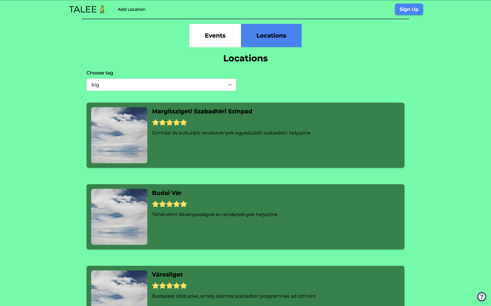
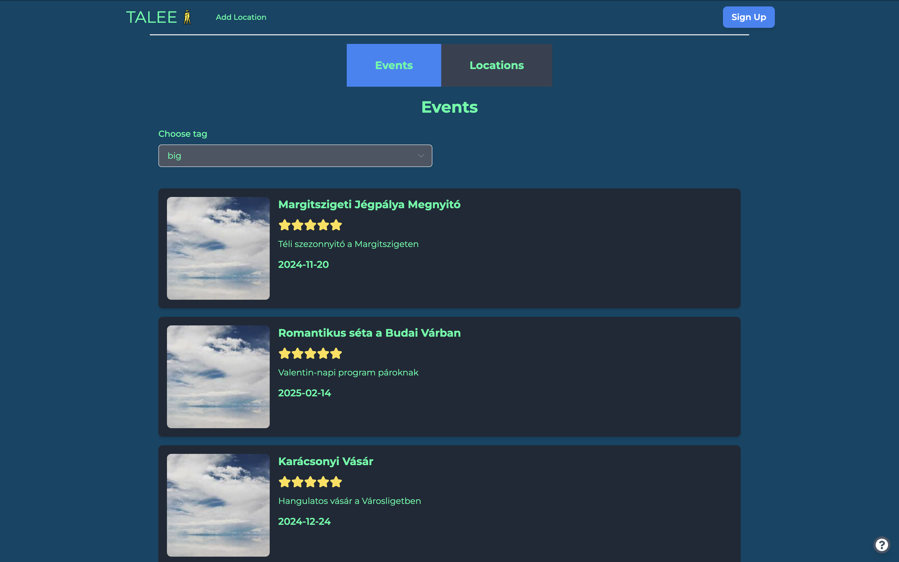

# Talee
Talee is a Java Spring Boot project with a PostgreSQL database and a Vite React frontend. All three components are containerized using Docker for easy deployment and scalability.
Talee is a website for searching and hosting events in Budapest. 
You can invite your friends, add tags and search based on them on the website.
We hope you will enjoy it!

### Contributors:

- Molnár Mariann: https://github.com/MariannaMolnar
- Pojbics Máté: https://github.com/matet2001
- dr. Ditrói-Tóth Zsuzsa: https://github.com/DTZsuzsi
- Sárosdi Márton: https://github.com/mmarci96

### Git repository:

https://github.com/DTZsuzsi/Talee.git

### Project Structure
- Backend: Java Spring Boot
- Database: PostgreSQL
- Frontend: Vite + React
- Containerization: Docker

### Prerequisites

Before running the project, ensure you have the following installed:
- Docker, you can install it from this link: https://docs.docker.com/engine/install/
- Docker Compose, you can install it from this link: https://docs.docker.com/compose/install/


### Setup and Installation

Here you find the steps of the installation of our project:
1. Clone the repository
```
git clone https://github.com/your-repo/talee.git
cd talee
```

2. Configure environment variables

If you have postgresql installed then please change the credentials for the project. 

Create a .env file in the root directory, and add the following environment variables:
- DB_PASSWORD=yourpassword
- DB_USERNAME=yourusername
- DB_URL=yourpostgresqldatabasename
- jwtSecret=======================CodeCool=Spring===========================
- jwtExpirationMs=86400000

Please delete our .env file.

Ensure that the values match your environment and security requirements.

If you don't have postgresql don't worry, just for now you can use our credentials, but please don't use it otherwise 
and don't give it to other people without our knowledge.

3. Run the project with Docker
Please enter in your terminal the following comment:
````
docker-compose up --build
````

This command will:
- Build and start the PostgreSQL database.
- Start the Spring Boot backend.
- Start the Vite React frontend.

The services will be available at:

Frontend: http://localhost:5173

Backend: http://localhost:8080

### Usage

Once the services are running, you can access the frontend to interact with the application and the backend API for examining purposes.

We have security on the website, not users just can see higlights from the website. Once you made the login, you can also:
- add new location,
- add new events (events are chained to locations, therefore you can find it there),
- modify locations, events, including adding or deleting tags
- invite friends.

This is the main page of the locations: 




This is the main page of the events: 



If you click to any box, you can see the details, you can edit and invite friends here too. 


### Stopping the Containers

To stop running  the containers enter the following command:
````
docker-compose down
````

### Troubleshooting

- Port Conflicts:
Ensure ports 5432, 8080, and 5173 are not in use by other processes.
- Docker Compose Issues:
Run docker-compose down and then docker-compose up --build to restart services.

