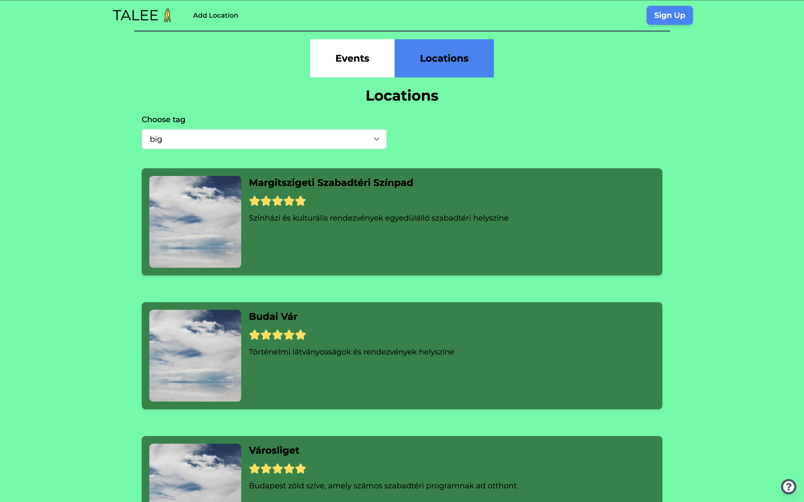
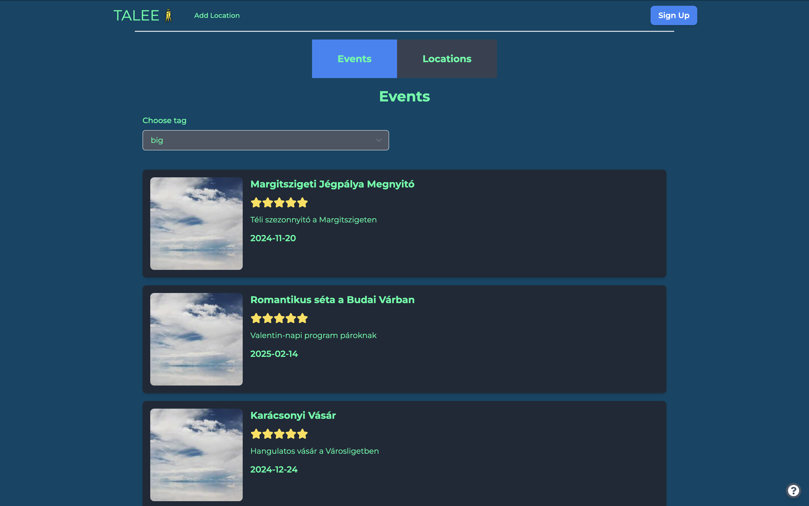

<!-- PROJECT LOGO -->
<br />
<div align="center">
  <a>
    
  </a>
<h1 align="center">Talee</h1>

  <p align="center">
    Your platform for discovering and hosting events in Budapest, with seamless friend invitations and event tagging!
</p>
</div>

<!-- TABLE OF CONTENTS -->
<details>
  <summary>Table of Contents</summary>
  <ol>
    <li>
      <a href="#about-the-project">About The Project</a>
      <ul>
        <li><a href="#built-with">Built With</a></li>
      </ul>
    </li>
    <li><a href="#contributors">Contributors</a></li>
    <li>
      <a href="#getting-started">Getting Started</a>
      <ul>
        <li><a href="#prerequisites">Prerequisites</a></li>
        <li><a href="#installation">Installation</a></li>
      </ul>
    </li>
    <li><a href="#usage">Usage</a></li>
    <li><a href="#stopping the containers">Stopping the Containers</a></li>
    <li><a href="#troubleshooting">Troubleshooting</a></li>
    <li><a href="#roadmap">Roadmap</a></li>
    <li><a href="#acknowledgments">Acknowledgments</a></li>
  </ol>
</details>

<!-- ABOUT THE PROJECT -->
## About The Project
Talee is a website for searching and hosting events in Budapest.
You can invite your friends, add tags and search based on them on the website.
Talee is a Java Spring Boot project with a PostgreSQL database and a Vite React frontend. 
All three components are containerized using Docker for easy deployment and scalability.
We hope you will enjoy it!

### Built With
- Backend:   
  [![SpringBoot][SpringBoot]][SpringBoot-url]
- Database:  
  [![PostgreSQL][PostgreSQL]][PostgreSQL-url]
- Frontend:  
  [![React][React.js]][React-url] 
  [![Vite][Vite]][Vite-url] 
  [![TailwindCSS][TailwindCSS]][TailwindCSS-url]
- Containerization:  
  [![Docker][Docker]][Docker-url]
  [![NGINX][NGINX]][NGINX-url]

### Contributors:

- **Molnár Marianna**   
    GitHub: https://github.com/MariannaMolnar  
    Email: molnarmariann91@gmail.com  
    [![LinkedIn][linkedin-shield]][linkedin-url-m]
- **Pojbics Máté**  
    GitHub: https://github.com/matet2001  
    Email: matet2001@gmail.com  
    [![LinkedIn][linkedin-shield]][linkedin-url]
- **dr. Ditrói-Tóth Zsuzsa**   
    GitHub: https://github.com/DTZsuzsi  
    [![LinkedIn][linkedin-shield]][linkedin-url-d]
- **Sárosdi Márton**  
    GitHub: https://github.com/mmarci96  
    Email: sarosdimarci@gmail.com  
    [![LinkedIn][linkedin-shield]][linkedin-url-ms]

  
<!-- GETTING STARTED -->
## Getting Started

This is an example of how you may give instructions on setting up your project locally.
To get a local copy up and running follow these simple example steps.

### Prerequisites

Before running the project, ensure you have the following installed:
- Docker, you can install it from this link: https://docs.docker.com/engine/install/
- Docker Compose, you can install it from this link: https://docs.docker.com/compose/install/


### Installation

Here you find the steps of the installation of our project:
1. Clone the repository
    ```
    git clone https://github.com/DTZsuzsi/Talee.git
    cd Talee
    ```

2. Configure Environment Variables

   To set up your environment variables, simply copy and rename the `.env.example` file to `.env` in the root directory. You can do this using the following terminal command:

    ```bash
    cp .env.example .env
    ```

   Once copied, open the `.env` file and update the values to match your credentials and environment settings. For example:

    ```plaintext
    DB_PASSWORD=yourpassword
    DB_USERNAME=yourusername
    jwtSecret=======================CodeCool=Spring===========================
    jwtExpirationMs=86400000
    ```

   Make sure that the credentials you provide are secure and appropriate for your environment.  
   The jwtSecret should be at least 64 characters long and cannot use "-" or "_". Alternatively, you can also generate one online: https://jwtsecret.com/generate.


3. Run the project with Docker

   Please enter in your terminal the following command:
    ````
    docker-compose up --build
    ````

   This command will:
    - Build and start the PostgreSQL database.
    - Start the Spring Boot backend.
    - Start the Vite React frontend.

   The services will be available at:
   http://localhost

### Usage

Once the services are running, you can access the frontend to interact with the application and the backend API for examining purposes.

We have security on the website, without logging in users are only able to see highlights of the website. Once you made the login, you can also:
- add new location,
- add new events (events are chained to locations, therefore you can find it there),
- modify locations, events, including adding or deleting tags
- invite friends.

This is the main page of the locations: 




This is the main page of the events: 



If you click on any box, you can see the details, you can edit and invite friends here too. 


### Stopping the Containers

To stop running  the containers enter the following command:
````
docker-compose down
````

### Troubleshooting

- Port Conflicts:
Ensure ports 5432, 8080, and 5173 are not in use by other processes.
- Docker Compose Issues:
Run docker-compose down and then docker-compose up --build to restart services.

<!-- ROADMAP -->
## Roadmap

- [x] Add Dockerize project
- [x] Add README
- [ ] Testing
    - [ ] Set up CI/CD pipeline
    - [ ] Increase coverage with more tests

<!-- ACKNOWLEDGMENTS -->
## Acknowledgments

* [React Icons](https://react-icons.github.io/react-icons/search)
* [Axios](https://axios-http.com/docs/intro)

[SpringBoot]: https://img.shields.io/badge/Spring%20Boot-6DB33F?style=for-the-badge&logo=springboot&logoColor=white
[SpringBoot-url]: https://spring.io/projects/spring-boot

[PostgreSQL]: https://img.shields.io/badge/PostgreSQL-336791?style=for-the-badge&logo=postgresql&logoColor=white
[PostgreSQL-url]: https://www.postgresql.org/

[React.js]: https://img.shields.io/badge/React-20232A?style=for-the-badge&logo=react&logoColor=61DAFB
[React-url]: https://reactjs.org/

[Vite]: https://img.shields.io/badge/Vite-646CFF?style=for-the-badge&logo=vite&logoColor=white
[Vite-url]: https://vitejs.dev/

[TailwindCSS]: https://img.shields.io/badge/TailwindCSS-06B6D4?style=for-the-badge&logo=tailwindcss&logoColor=white
[TailwindCSS-url]: https://tailwindcss.com/

[Docker]: https://img.shields.io/badge/Docker-2496ED?style=for-the-badge&logo=docker&logoColor=white
[Docker-url]: https://www.docker.com/

[NGINX]: https://img.shields.io/badge/NGINX-009639?style=for-the-badge&logo=nginx&logoColor=white
[NGINX-url]: https://nginx.org/

[linkedin-shield]: https://img.shields.io/badge/-LinkedIn-black.svg?style=for-the-badge&logo=linkedin&colorB=555
[linkedin-url]: https://www.linkedin.com/in/m%C3%A1t%C3%A9-pojbics/

[linkedin-url-m]: https://www.linkedin.com/in/marianna-molnar-21956289
[linkedin-url-d]: https://www.linkedin.com/in/zsuzsa-ditroi-toth-8b339a54/
[linkedin-url-ms]: https://www.linkedin.com/in/maton-sarosdi
